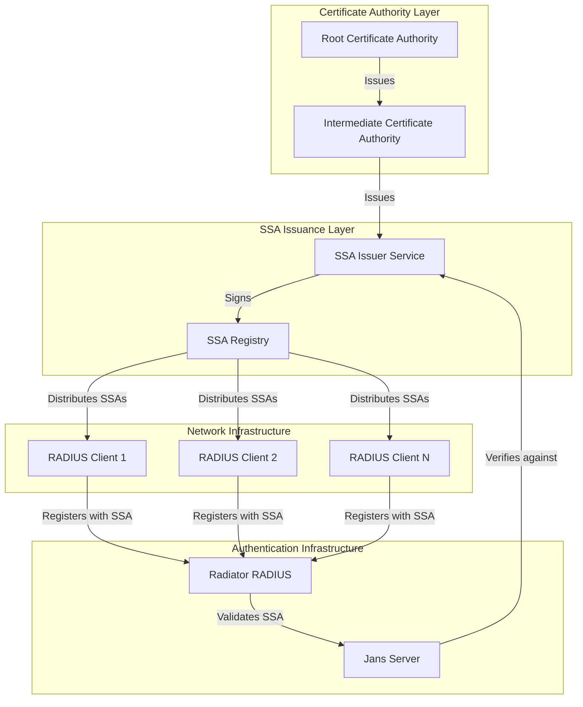
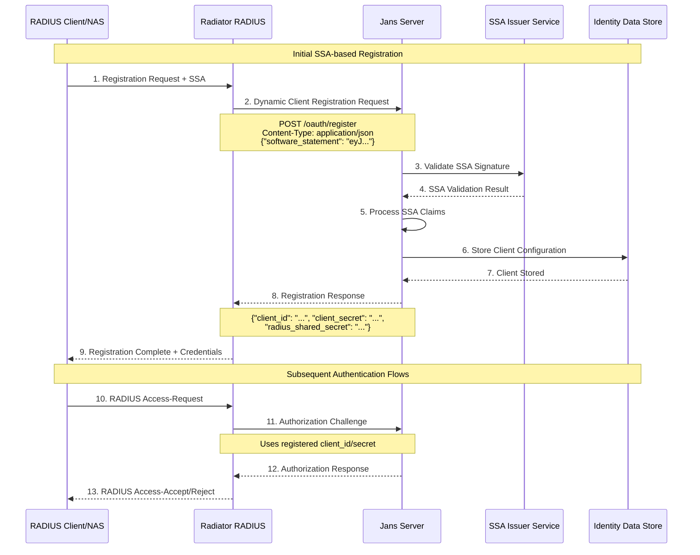
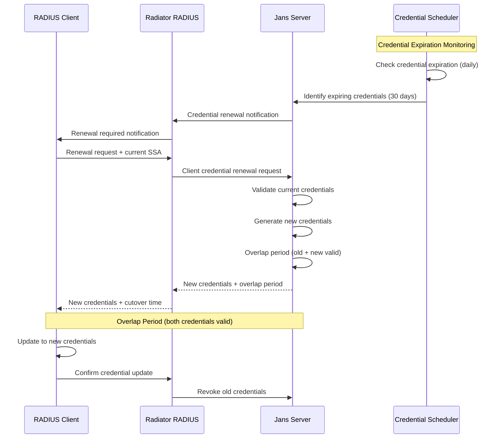
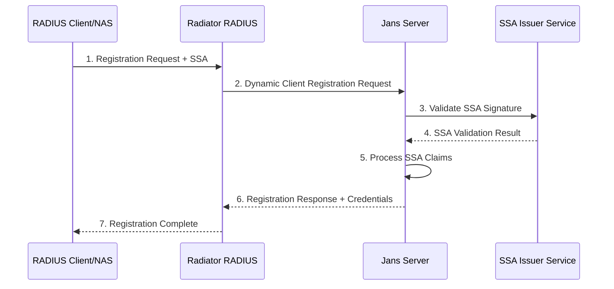
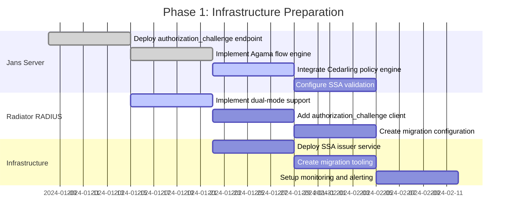
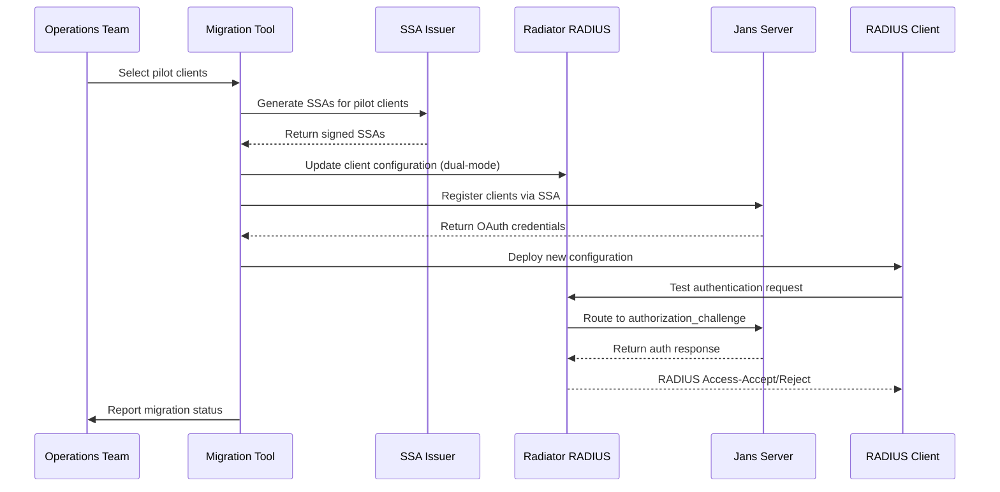
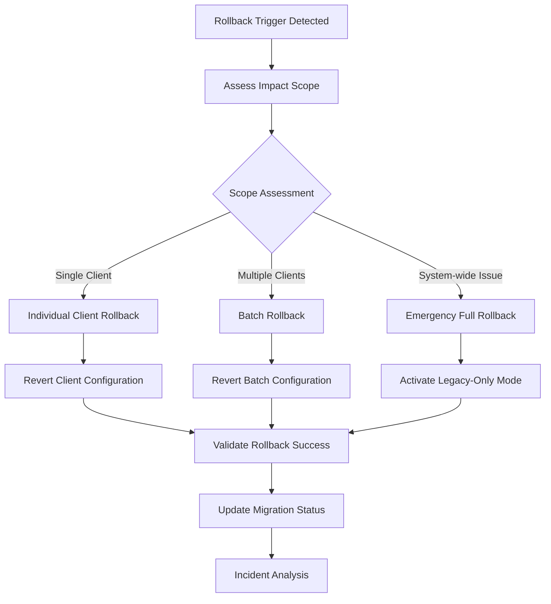

# Radiator Integration Modernization

## 1. Background & Problem Statement

### Current State Analysis

The existing integration between Gluu Server/Jans and Radiator RADIUS server relies on OAuth 2.0 Resource Owner Password Grant (ROPG), which presents several critical limitations:

**Security Vulnerabilities:**
- Direct password transmission between Radiator and Jans server
- Limited credential protection mechanisms
- Exposure to credential theft and replay attacks
- Lack of multi-factor authentication support

**Operational Limitations:**
- Manual OAuth client registration and management
- Static authentication flows with limited customization
- No centralized policy enforcement
- Difficult credential lifecycle management
- Limited audit and compliance capabilities

**Scalability Challenges:**
- Manual processes don't scale for large network deployments
- Tight coupling between RADIUS and OAuth layers
- Limited ability to adapt to changing security requirements
- Operational overhead for client onboarding and management

### Business Drivers for Modernization

**Security Enhancement:**
- Eliminate password exposure in authentication flows
- Implement policy-based authorization decisions
- Support multi-factor authentication scenarios
- Enhance audit and compliance capabilities

**Operational Efficiency:**
- Automate client registration and lifecycle management
- Reduce manual configuration and maintenance overhead
- Improve system monitoring and observability
- Enable rapid deployment of security policy changes

**Future-Proofing:**
- Adopt modern OAuth and OpenID Connect standards
- Support emerging authentication methods and protocols
- Enable integration with cloud-native security services
- Provide foundation for zero-trust network architecture

## 2. Requirements Specification

*Note: Detailed requirements are maintained in the separate [requirements.md](requirements.md) document. Key requirements summary below:*

### Functional Requirements Summary

**Authentication Flow Modernization:**
- Replace ROPG with /authorization_challenge endpoint
- Implement Agama flows for flexible authentication logic
- Support multi-step authentication including MFA scenarios
- Maintain RADIUS protocol compliance and backward compatibility

**Policy-Based Authorization:**
- Integrate Cedarling for Cedar policy evaluation
- Support dynamic policy updates without service restart
- Provide comprehensive authorization context to policy engine
- Enable policy-determined RADIUS attribute inclusion

**SSA-Based Client Registration:**
- Implement Software Statement Assertion validation
- Support automated OAuth client provisioning
- Enable secure credential distribution and lifecycle management
- Provide client registration audit trails

### Non-Functional Requirements Summary

**Security Requirements:**
- Eliminate plaintext password transmission
- Implement comprehensive input validation and sanitization
- Support rate limiting and brute force protection
- Provide encrypted credential storage and secure communication

**Performance Requirements:**
- Maintain sub-200ms response times for 95% of requests
- Support minimum 1000 requests per second per server instance
- Enable horizontal scaling without authentication flow changes
- Implement connection pooling and caching optimizations

**Operational Requirements:**
- Support configuration through environment variables and files
- Provide comprehensive audit logging for compliance
- Enable rolling updates and blue-green deployments
- Support migration from existing ROPG implementation

### Current State Architecture (ROPG-based)

The existing implementation follows a direct credential exchange pattern:

```
[RADIUS Client] --RADIUS--> [Radiator RADIUS] --ROPG--> [Jans /token] --Response--> [Radiator] --RADIUS--> [RADIUS Client]
```

**Current Flow Limitations:**
- Direct password transmission to Jans server
- Limited authentication customization
- No centralized policy enforcement
- Manual client registration process
- Tight coupling between RADIUS and OAuth layers

### Target State Architecture

The modernized architecture introduces multiple security and extensibility layers:

```mermaid
graph TB
    subgraph "Network Access Layer"
        RC[RADIUS Client/NAS]
    end
    
    subgraph "RADIUS Processing Layer"
        RR[Radiator RADIUS Server]
    end
    
    subgraph "Authentication & Authorization Layer"
        subgraph "Jans Server"
            ACE[/authorization_challenge Endpoint]
            AF[Agama Flow Engine]
            DCR[Dynamic Client Registration]
        end
        
        subgraph "Policy Layer"
            CL[Cedarling Policy Engine]
            CP[Cedar Policies]
        end
    end
    
    subgraph "Identity Layer"
        IDS[Identity Data Store]
    end
    
    RC -->|RADIUS Access-Request| RR
    RR -->|Authorization Challenge| ACE
    ACE -->|Execute Flow| AF
    AF -->|Policy Evaluation| CL
    CL -->|Policy Decision| AF
    AF -->|User Lookup| IDS
    AF -->|Challenge Response| ACE
    ACE -->|Auth Result| RR
    RR -->|RADIUS Access-Accept/Reject| RC
    
    DCR -->|SSA Registration| RR
```

### Trust Boundaries and Security Zones

**Zone 1: Network Access (Untrusted)**
- RADIUS Clients/NAS devices
- Standard RADIUS protocol with shared secrets
- Network-level access control

**Zone 2: RADIUS Processing (Semi-Trusted)**
- Radiator RADIUS server
- RADIUS protocol termination
- OAuth client authentication to Jans

**Zone 3: Authentication & Authorization (Trusted)**
- Jans server with authorization_challenge endpoint
- Agama flow execution environment
- Cedarling policy evaluation engine
- Secure API communication (mTLS)

**Zone 4: Identity Data (Highly Trusted)**
- User identity stores (LDAP/Database)
- Encrypted data at rest
- Restricted network access

## Components and Interfaces

### Radiator RADIUS Server

**Responsibilities:**
- Terminate RADIUS protocol from network access servers
- Translate RADIUS requests to Jans authorization challenges
- Map Jans responses back to RADIUS Access-Accept/Reject
- Maintain RADIUS client shared secrets and accounting
- Handle SSA-based client registration workflows

**Key Interfaces:**
- RADIUS protocol (UDP 1812/1813) with NAS devices
- HTTPS API calls to Jans /authorization_challenge endpoint
- OAuth 2.0 client credentials for Jans authentication
- Dynamic client registration API for SSA processing

**Configuration Requirements:**
- RADIUS client definitions with shared secrets
- Jans server endpoint configuration
- OAuth client credentials for server-to-server communication
- Attribute mapping between RADIUS and OAuth scopes

### Jans Server /authorization_challenge Endpoint

**Responsibilities:**
- Accept non-browser authentication challenges from Radiator
- Route authentication requests to appropriate Agama flows
- Coordinate with Cedarling for authorization policy evaluation
- Return structured authentication/authorization responses
- Support dynamic client registration via SSA validation

**Key Interfaces:**
- RESTful API for authorization challenges
- Agama flow execution engine integration
- Cedarling policy evaluation API
- Dynamic client registration endpoint (RFC 7591 + SSA extensions)
- Identity store connectors for user lookup

**Authentication Challenge Request Format:**
```json
{
  "client_id": "radiator_client_123",
  "challenge_type": "radius_auth",
  "user_identifier": "username@domain.com",
  "radius_attributes": {
    "NAS-IP-Address": "192.168.1.100",
    "NAS-Port": "1234",
    "Service-Type": "Framed-User"
  },
  "authentication_context": {
    "password": "encrypted_or_hashed_credential",
    "mfa_token": "optional_second_factor"
  }
}
```

### Agama Flow Engine

**Responsibilities:**
- Execute customizable authentication business logic
- Support multi-step authentication processes (MFA, conditional logic)
- Integrate with external authentication providers when needed
- Provide authentication context to authorization layer
- Handle authentication errors and edge cases gracefully

**Flow Configuration:**
- RADIUS-specific authentication flows per client or policy
- Conditional logic based on user attributes or risk assessment
- Integration points for external MFA providers
- Error handling and fallback authentication methods

**Authentication Context Output:**
```json
{
  "authentication_result": "success|failure|challenge_required",
  "user_identity": {
    "subject": "user123",
    "attributes": {
      "email": "user@example.com",
      "groups": ["network_users", "vpn_access"],
      "department": "engineering"
    }
  },
  "authentication_methods": ["password", "totp"],
  "risk_score": 0.2,
  "session_context": {
    "authentication_time": "2024-01-09T10:30:00Z",
    "client_context": "radius_client_123"
  }
}
```

### Cedarling Policy Engine

**Responsibilities:**
- Evaluate Cedar policies for authorization decisions
- Process authentication context and RADIUS request attributes
- Return policy decisions with optional additional attributes
- Support dynamic policy updates without service restart
- Provide audit trails for policy evaluation decisions

**Policy Evaluation Input:**
```json
{
  "principal": {
    "type": "User",
    "id": "user123",
    "attributes": {
      "groups": ["network_users", "vpn_access"],
      "department": "engineering",
      "authentication_methods": ["password", "totp"]
    }
  },
  "action": {
    "type": "NetworkAccess",
    "id": "radius_authentication"
  },
  "resource": {
    "type": "NetworkResource",
    "id": "corporate_network",
    "attributes": {
      "nas_ip": "192.168.1.100",
      "service_type": "Framed-User",
      "client_id": "radiator_client_123"
    }
  },
  "context": {
    "time": "2024-01-09T10:30:00Z",
    "risk_score": 0.2,
    "authentication_strength": "multi_factor"
  }
}
```

**Policy Decision Output:**
```json
{
  "decision": "Allow|Deny",
  "policies_evaluated": ["corporate_network_access", "mfa_requirement"],
  "additional_attributes": {
    "Session-Timeout": 3600,
    "Framed-IP-Address": "10.0.1.100",
    "Filter-Id": "engineering_acl"
  },
  "audit_info": {
    "evaluation_time": "2024-01-09T10:30:01Z",
    "policy_version": "v1.2.3"
  }
}
```

### Dynamic Client Registration (SSA-based)

**Responsibilities:**
- Validate Software Statement Assertions for new RADIUS clients
- Provision OAuth client credentials for Radiator integration
- Generate and distribute RADIUS shared secrets securely
- Support client lifecycle management (update, revoke, deregister)
- Maintain audit trails for client registration activities

**SSA Registration Flow:**
1. RADIUS client submits SSA with registration request
2. Jans validates SSA signature and claims
3. OAuth client is provisioned with appropriate scopes
4. RADIUS shared secret is generated and returned securely
5. Client configuration is distributed to Radiator server

## Data Models

### Authentication Challenge Request
```typescript
interface AuthenticationChallenge {
  client_id: string;
  challenge_type: "radius_auth";
  user_identifier: string;
  radius_attributes: RadiusAttributes;
  authentication_context: AuthenticationContext;
  request_id: string;
  timestamp: string;
}

interface RadiusAttributes {
  "NAS-IP-Address": string;
  "NAS-Port"?: string;
  "Service-Type": string;
  "Framed-Protocol"?: string;
  [key: string]: string | number | undefined;
}

interface AuthenticationContext {
  password?: string;
  mfa_token?: string;
  certificate?: string;
  challenge_response?: string;
}
```

### Policy Evaluation Context
```typescript
interface PolicyContext {
  principal: Principal;
  action: Action;
  resource: Resource;
  context: ContextAttributes;
}

interface Principal {
  type: "User";
  id: string;
  attributes: UserAttributes;
}

interface UserAttributes {
  groups: string[];
  department?: string;
  authentication_methods: string[];
  risk_score?: number;
  [key: string]: any;
}
```

### SSA Registration Request
```typescript
interface SSARegistrationRequest {
  software_statement: string; // JWT containing SSA
  client_name: string;
  radius_shared_secret?: string; // Optional, generated if not provided
  redirect_uris?: string[]; // Not used for RADIUS but required by spec
  grant_types: ["client_credentials"];
  scope: string; // "radius_auth" or similar
}
```

## Correctness Properties

*A property is a characteristic or behavior that should hold true across all valid executions of a system-essentially, a formal statement about what the system should do. Properties serve as the bridge between human-readable specifications and machine-verifiable correctness guarantees.*

### Property 1: Authentication Flow Routing
*For any* RADIUS authentication request, the system should route it to the /authorization_challenge endpoint and execute the appropriate Agama flow, never using the deprecated /token endpoint
**Validates: Requirements 1.1, 1.2, 2.1**

### Property 2: Authentication Response Mapping
*For any* authentication result (success or failure), the system should return appropriately formatted responses that can be correctly mapped to RADIUS Access-Accept or Access-Reject messages
**Validates: Requirements 1.3, 1.4, 2.4**

### Property 3: Multi-Step Authentication Support
*For any* Agama flow configuration, the system should support multi-step authentication processes and provide complete user identity and authentication context upon successful completion
**Validates: Requirements 2.2, 2.3**

### Property 4: Policy Evaluation Integration
*For any* successful authentication, the system should invoke Cedarling for authorization evaluation with complete context data before returning the final response
**Validates: Requirements 3.1, 3.2**

### Property 5: Policy Decision Enforcement
*For any* Cedarling policy decision (permit or deny), the system should include appropriate attributes in RADIUS responses or return proper Access-Reject messages with reason codes
**Validates: Requirements 3.3, 3.4**

### Property 6: SSA Registration Lifecycle
*For any* valid Software Statement Assertion, the system should validate signatures and claims, provision appropriate credentials upon success, or return detailed error information upon failure
**Validates: Requirements 4.1, 4.2, 4.3, 4.4**

### Property 7: RADIUS Protocol Compliance
*For any* RADIUS Access-Request packet, the system should preserve all attributes, forward relevant ones to authorization context, and include policy-determined attributes in responses
**Validates: Requirements 5.1, 5.2, 5.3**

### Property 8: RADIUS Accounting Correlation
*For any* RADIUS accounting message (Start/Stop/Interim-Update), the system should properly correlate it with the corresponding authentication session
**Validates: Requirements 5.4**

### Property 9: Credential Security
*For any* authentication challenge, the system should never transmit passwords in plaintext and should use secure token-based communication with appropriate expiration times
**Validates: Requirements 6.1, 6.2**

### Property 10: Input Validation and Security
*For any* input parameter, the system should validate and sanitize data to prevent injection attacks, implement rate limiting for authentication attempts, and encrypt sensitive data at rest
**Validates: Requirements 6.3, 6.4, 6.5**

### Property 11: Comprehensive Audit Logging
*For any* authentication attempt, authorization decision, or SSA registration event, the system should generate structured log entries suitable for SIEM integration with configurable levels and rotation
**Validates: Requirements 7.1, 7.2, 7.3, 7.4, 7.5**

### Property 12: Dynamic Configuration Management
*For any* configuration change (flows, policies, or system settings), the system should support updates without restart and validate configurations at startup to detect misconfigurations
**Validates: Requirements 2.5, 3.5, 9.1, 9.2, 9.3**

### Property 13: Horizontal Scaling Support
*For any* system scaling operation, adding additional Jans server instances should not require authentication flow changes and should maintain proper connection pooling and caching
**Validates: Requirements 8.3, 8.4**

### Property 14: Migration Mode Dual Operation
*For any* authentication request during migration, the system should route it to the appropriate flow (ROPG or authorization_challenge) based on client configuration while maintaining audit trails
**Validates: Requirements 10.1, 10.2, 10.4**

### Property 15: Configuration Migration and Rollback
*For any* existing OAuth client configuration, migration tools should convert it to the new format correctly, and rollback operations should restore previous configurations when needed
**Validates: Requirements 10.3, 10.5**

## Error Handling

### Authentication Errors
- **Invalid Credentials**: Return RADIUS Access-Reject with appropriate reason codes
- **Agama Flow Failures**: Log detailed error information and return standardized error responses
- **Timeout Scenarios**: Implement configurable timeouts with graceful degradation
- **Network Connectivity Issues**: Retry logic with exponential backoff for transient failures

### Authorization Errors
- **Policy Evaluation Failures**: Log policy engine errors and default to deny for security
- **Cedarling Unavailability**: Implement fallback authorization logic or fail-secure mode
- **Policy Syntax Errors**: Validate policies at deployment time to prevent runtime failures

### Registration Errors
- **Invalid SSA**: Return detailed validation errors for troubleshooting
- **Duplicate Client Registration**: Handle conflicts with appropriate error responses
- **Certificate Validation Failures**: Provide clear error messages for certificate issues

### System Errors
- **Configuration Errors**: Fail fast at startup with clear error messages
- **Resource Exhaustion**: Implement circuit breakers and graceful degradation
- **Database Connectivity**: Retry logic with connection pooling and health checks

## Testing Strategy

### Dual Testing Approach
The system will be validated using both unit tests and property-based tests to ensure comprehensive coverage:

**Unit Tests:**
- Verify specific examples and edge cases for each component
- Test integration points between Radiator, Jans, and Cedarling
- Validate error conditions and exception handling
- Test configuration validation and startup health checks

**Property-Based Tests:**
- Verify universal properties across all inputs using randomized test data
- Test authentication flows with generated RADIUS requests and user credentials
- Validate policy evaluation with random user attributes and policy configurations
- Test SSA registration with generated certificates and client configurations

### Property-Based Testing Configuration
- **Testing Framework**: Use appropriate PBT library for the implementation language (e.g., Hypothesis for Python, fast-check for TypeScript, QuickCheck for Haskell)
- **Test Iterations**: Minimum 100 iterations per property test to ensure comprehensive input coverage
- **Test Tagging**: Each property test must reference its design document property using the format: **Feature: radius-auth-modernization, Property {number}: {property_text}**

### Test Data Generation
- **RADIUS Requests**: Generate valid and invalid RADIUS packets with various attribute combinations
- **User Credentials**: Create test users with different authentication methods and attribute sets
- **SSA Certificates**: Generate valid and invalid Software Statement Assertions for registration testing
- **Policy Configurations**: Create Cedar policies with various permission and denial scenarios

### Integration Testing
- **End-to-End Flows**: Test complete authentication flows from RADIUS client to final authorization decision
- **Migration Scenarios**: Validate dual-mode operation and configuration migration processes
- **Performance Testing**: Verify response time and throughput requirements under load
- **Security Testing**: Validate credential handling, input sanitization, and audit logging

### Monitoring and Observability
- **Metrics Collection**: Implement comprehensive metrics for authentication rates, error rates, and response times
- **Health Checks**: Provide endpoints for monitoring system health and component availability
- **Distributed Tracing**: Enable request tracing across all system components for debugging
- **Alerting**: Configure alerts for authentication failures, policy evaluation errors, and system performance degradation

## Agama Flow Design

### Primary RADIUS Authentication Flow

The main Agama flow (`radius-auth-flow`) handles the complete authentication and authorization process for RADIUS requests.

#### Flow Entry Point and Inputs

**Flow Name:** `radius-auth-flow`
**Trigger:** Authorization challenge request from Radiator RADIUS server
**Input Parameters:**
```
{
  user_identifier: string,
  radius_attributes: RadiusAttributeMap,
  client_metadata: ClientMetadata,
  authentication_context: AuthenticationContext,
  request_id: string
}
```

#### Step-by-Step Flow Logic

**Step 1: Input Validation and Context Setup**
```pseudocode
FLOW radius-auth-flow(inputs)
  BEGIN
    // Validate required inputs
    IF user_identifier IS EMPTY OR radius_attributes IS EMPTY THEN
      RETURN error("INVALID_REQUEST", "Missing required parameters")
    END IF
    
    // Initialize flow context
    flow_context = {
      request_id: inputs.request_id,
      start_time: current_timestamp(),
      user_identifier: inputs.user_identifier,
      client_id: inputs.client_metadata.client_id,
      nas_ip: inputs.radius_attributes["NAS-IP-Address"],
      service_type: inputs.radius_attributes["Service-Type"]
    }
    
    // Log authentication attempt
    LOG_AUTH_ATTEMPT(flow_context)
```

**Step 2: User Identity Resolution**
```pseudocode
    // Resolve user identity from identifier
    user_identity = CALL resolve_user_identity(inputs.user_identifier)
    
    IF user_identity IS NULL THEN
      LOG_AUTH_FAILURE(flow_context, "USER_NOT_FOUND")
      RETURN error("AUTHENTICATION_FAILED", "Invalid user identifier")
    END IF
    
    // Enrich context with user attributes
    flow_context.user_attributes = user_identity.attributes
    flow_context.user_groups = user_identity.groups
    flow_context.user_department = user_identity.department
```

**Step 3: Client and NAS Validation**
```pseudocode
    // Validate RADIUS client authorization
    client_config = CALL get_client_configuration(inputs.client_metadata.client_id)
    
    IF client_config IS NULL OR NOT client_config.enabled THEN
      LOG_AUTH_FAILURE(flow_context, "INVALID_CLIENT")
      RETURN error("AUTHENTICATION_FAILED", "Client not authorized")
    END IF
    
    // Validate NAS IP against client configuration
    IF inputs.radius_attributes["NAS-IP-Address"] NOT IN client_config.allowed_nas_ips THEN
      LOG_AUTH_FAILURE(flow_context, "INVALID_NAS")
      RETURN error("AUTHENTICATION_FAILED", "NAS not authorized for client")
    END IF
```

**Step 4: Authentication Method Selection and Execution**
```pseudocode
    // Determine required authentication methods based on policy
    auth_policy = CALL get_authentication_policy(user_identity, client_config, inputs.radius_attributes)
    required_methods = auth_policy.required_authentication_methods
    
    authentication_results = []
    
    FOR EACH method IN required_methods DO
      SWITCH method
        CASE "password":
          result = CALL authenticate_password(user_identity, inputs.authentication_context.password)
        CASE "mfa_totp":
          result = CALL authenticate_totp(user_identity, inputs.authentication_context.mfa_token)
        CASE "certificate":
          result = CALL authenticate_certificate(user_identity, inputs.authentication_context.certificate)
        DEFAULT:
          result = {success: false, error: "UNSUPPORTED_METHOD"}
      END SWITCH
      
      authentication_results.ADD(result)
      
      IF NOT result.success THEN
        LOG_AUTH_FAILURE(flow_context, "AUTH_METHOD_FAILED", method)
        RETURN error("AUTHENTICATION_FAILED", result.error_message)
      END IF
    END FOR
    
    // All authentication methods succeeded
    flow_context.authentication_methods = required_methods
    flow_context.authentication_strength = CALCULATE_AUTH_STRENGTH(required_methods)
```

**Step 5: Risk Assessment and Conditional Logic**
```pseudocode
    // Calculate risk score based on context
    risk_factors = {
      nas_ip: inputs.radius_attributes["NAS-IP-Address"],
      time_of_day: current_time(),
      user_location: user_identity.last_known_location,
      authentication_history: GET_RECENT_AUTH_HISTORY(user_identity.id)
    }
    
    risk_score = CALL calculate_risk_score(risk_factors)
    flow_context.risk_score = risk_score
    
    // Apply conditional authentication based on risk
    IF risk_score > auth_policy.high_risk_threshold THEN
      // Require additional authentication
      IF "mfa_totp" NOT IN required_methods THEN
        additional_mfa = CALL authenticate_totp(user_identity, inputs.authentication_context.mfa_token)
        IF NOT additional_mfa.success THEN
          LOG_AUTH_FAILURE(flow_context, "HIGH_RISK_MFA_FAILED")
          RETURN error("AUTHENTICATION_FAILED", "Additional authentication required")
        END IF
        flow_context.authentication_methods.ADD("mfa_totp")
      END IF
    END IF
```

**Step 6: Authorization Policy Evaluation**
```pseudocode
    // Prepare Cedarling policy evaluation context
    policy_context = {
      principal: {
        type: "User",
        id: user_identity.id,
        attributes: {
          groups: user_identity.groups,
          department: user_identity.department,
          authentication_methods: flow_context.authentication_methods,
          authentication_strength: flow_context.authentication_strength
        }
      },
      action: {
        type: "NetworkAccess",
        id: "radius_authentication"
      },
      resource: {
        type: "NetworkResource",
        id: client_config.resource_id,
        attributes: {
          nas_ip: inputs.radius_attributes["NAS-IP-Address"],
          service_type: inputs.radius_attributes["Service-Type"],
          client_id: inputs.client_metadata.client_id
        }
      },
      context: {
        time: current_timestamp(),
        risk_score: flow_context.risk_score,
        authentication_strength: flow_context.authentication_strength,
        request_attributes: inputs.radius_attributes
      }
    }
    
    // Invoke Cedarling for authorization decision
    policy_decision = CALL cedarling_evaluate_policy(policy_context)
    
    IF policy_decision IS NULL THEN
      LOG_AUTH_FAILURE(flow_context, "POLICY_EVALUATION_ERROR")
      RETURN error("AUTHORIZATION_FAILED", "Policy evaluation failed")
    END IF
```

**Step 7: Decision Processing and Response Generation**
```pseudocode
    SWITCH policy_decision.decision
      CASE "Allow":
        // Generate successful authentication response
        response_attributes = MERGE(
          policy_decision.additional_attributes,
          client_config.default_attributes,
          CALCULATE_SESSION_ATTRIBUTES(user_identity, flow_context)
        )
        
        LOG_AUTH_SUCCESS(flow_context, policy_decision)
        
        RETURN success_response({
          user_identity: user_identity,
          authentication_methods: flow_context.authentication_methods,
          authorization_attributes: response_attributes,
          session_context: {
            authentication_time: flow_context.start_time,
            risk_score: flow_context.risk_score,
            policies_applied: policy_decision.policies_evaluated
          }
        })
        
      CASE "Deny":
        LOG_AUTH_FAILURE(flow_context, "POLICY_DENIED", policy_decision.reason)
        RETURN error("AUTHORIZATION_FAILED", policy_decision.reason)
        
      CASE "Challenge":
        // Handle step-up authentication requirements
        challenge_requirements = policy_decision.challenge_requirements
        
        LOG_AUTH_CHALLENGE(flow_context, challenge_requirements)
        
        RETURN challenge_response({
          challenge_type: challenge_requirements.type,
          challenge_data: challenge_requirements.data,
          flow_continuation_token: GENERATE_CONTINUATION_TOKEN(flow_context)
        })
        
      DEFAULT:
        LOG_AUTH_FAILURE(flow_context, "UNKNOWN_POLICY_DECISION")
        RETURN error("AUTHORIZATION_FAILED", "Unknown policy decision")
    END SWITCH
    
  END FLOW
```

#### Error Handling and Edge Cases

**Authentication Method Failures:**
```pseudocode
FUNCTION handle_auth_method_error(method, error, flow_context)
  BEGIN
    SWITCH error.type
      CASE "CREDENTIAL_EXPIRED":
        LOG_AUTH_FAILURE(flow_context, "CREDENTIAL_EXPIRED", method)
        RETURN error("AUTHENTICATION_FAILED", "Credentials have expired")
        
      CASE "ACCOUNT_LOCKED":
        LOG_AUTH_FAILURE(flow_context, "ACCOUNT_LOCKED", method)
        RETURN error("AUTHENTICATION_FAILED", "Account is locked")
        
      CASE "INVALID_CREDENTIAL":
        INCREMENT_FAILED_ATTEMPTS(flow_context.user_identifier)
        IF GET_FAILED_ATTEMPTS(flow_context.user_identifier) > MAX_ATTEMPTS THEN
          LOCK_ACCOUNT(flow_context.user_identifier)
        END IF
        LOG_AUTH_FAILURE(flow_context, "INVALID_CREDENTIAL", method)
        RETURN error("AUTHENTICATION_FAILED", "Invalid credentials")
        
      DEFAULT:
        LOG_AUTH_FAILURE(flow_context, "UNKNOWN_AUTH_ERROR", method)
        RETURN error("AUTHENTICATION_FAILED", "Authentication error")
    END SWITCH
  END FUNCTION
```

**Policy Evaluation Failures:**
```pseudocode
FUNCTION handle_policy_error(error, flow_context)
  BEGIN
    SWITCH error.type
      CASE "POLICY_ENGINE_UNAVAILABLE":
        // Fail-secure: deny access when policy engine is unavailable
        LOG_SYSTEM_ERROR(flow_context, "CEDARLING_UNAVAILABLE")
        RETURN error("AUTHORIZATION_FAILED", "Authorization service unavailable")
        
      CASE "POLICY_SYNTAX_ERROR":
        LOG_SYSTEM_ERROR(flow_context, "POLICY_SYNTAX_ERROR", error.details)
        RETURN error("AUTHORIZATION_FAILED", "Policy configuration error")
        
      CASE "TIMEOUT":
        LOG_SYSTEM_ERROR(flow_context, "POLICY_TIMEOUT")
        RETURN error("AUTHORIZATION_FAILED", "Authorization timeout")
        
      DEFAULT:
        LOG_SYSTEM_ERROR(flow_context, "UNKNOWN_POLICY_ERROR")
        RETURN error("AUTHORIZATION_FAILED", "Authorization error")
    END SWITCH
  END FUNCTION
```

#### Extension Points and Reusability

**1. Authentication Method Plugins:**
```pseudocode
INTERFACE AuthenticationMethod
  FUNCTION authenticate(user_identity, credential_data) RETURNS AuthResult
  FUNCTION get_method_name() RETURNS string
  FUNCTION get_strength_level() RETURNS integer
END INTERFACE

// Extensible authentication methods
REGISTER_AUTH_METHOD("password", PasswordAuthenticator)
REGISTER_AUTH_METHOD("mfa_totp", TOTPAuthenticator)
REGISTER_AUTH_METHOD("certificate", CertificateAuthenticator)
REGISTER_AUTH_METHOD("biometric", BiometricAuthenticator)  // Future extension
```

**2. Risk Assessment Plugins:**
```pseudocode
INTERFACE RiskAssessor
  FUNCTION calculate_risk(risk_factors) RETURNS RiskScore
  FUNCTION get_risk_factors() RETURNS string[]
END INTERFACE

// Pluggable risk assessment
REGISTER_RISK_ASSESSOR("geolocation", GeolocationRiskAssessor)
REGISTER_RISK_ASSESSOR("behavioral", BehavioralRiskAssessor)
REGISTER_RISK_ASSESSOR("device_fingerprint", DeviceFingerprintRiskAssessor)
```

**3. Client-Specific Flow Variations:**
```pseudocode
// Flow selection based on client configuration
FUNCTION select_authentication_flow(client_config, request_context)
  BEGIN
    IF client_config.custom_flow_name IS NOT NULL THEN
      RETURN client_config.custom_flow_name
    ELSE IF request_context.service_type == "Administrative-User" THEN
      RETURN "radius-admin-auth-flow"
    ELSE IF client_config.requires_certificate_auth THEN
      RETURN "radius-certificate-auth-flow"
    ELSE
      RETURN "radius-auth-flow"  // Default flow
    END IF
  END FUNCTION
```

**4. Policy Context Enrichment:**
```pseudocode
INTERFACE ContextEnricher
  FUNCTION enrich_context(base_context, enrichment_data) RETURNS EnrichedContext
END INTERFACE

// Extensible context enrichment
REGISTER_CONTEXT_ENRICHER("device_info", DeviceInfoEnricher)
REGISTER_CONTEXT_ENRICHER("location", LocationEnricher)
REGISTER_CONTEXT_ENRICHER("threat_intel", ThreatIntelligenceEnricher)
```

### Supporting Flows

#### Certificate Authentication Flow
```pseudocode
FLOW radius-certificate-auth-flow(inputs)
  BEGIN
    // Specialized flow for certificate-based authentication
    certificate = inputs.authentication_context.certificate
    
    IF certificate IS NULL THEN
      RETURN error("AUTHENTICATION_FAILED", "Certificate required")
    END IF
    
    cert_validation = CALL validate_certificate(certificate)
    IF NOT cert_validation.valid THEN
      RETURN error("AUTHENTICATION_FAILED", cert_validation.error)
    END IF
    
    // Extract user identity from certificate
    user_identity = CALL extract_user_from_certificate(certificate)
    
    // Continue with standard authorization flow
    CALL standard_authorization_flow(user_identity, inputs)
  END FLOW
```

#### Administrative User Flow
```pseudocode
FLOW radius-admin-auth-flow(inputs)
  BEGIN
    // Enhanced security flow for administrative users
    // Requires MFA and additional logging
    
    user_identity = CALL resolve_user_identity(inputs.user_identifier)
    
    IF NOT user_identity.is_admin THEN
      RETURN error("AUTHENTICATION_FAILED", "Administrative access required")
    END IF
    
    // Require both password and MFA for admin users
    password_result = CALL authenticate_password(user_identity, inputs.authentication_context.password)
    mfa_result = CALL authenticate_totp(user_identity, inputs.authentication_context.mfa_token)
    
    IF NOT (password_result.success AND mfa_result.success) THEN
      LOG_ADMIN_AUTH_FAILURE(user_identity, inputs)
      RETURN error("AUTHENTICATION_FAILED", "Multi-factor authentication required")
    END IF
    
    // Enhanced logging for administrative access
    LOG_ADMIN_AUTH_SUCCESS(user_identity, inputs)
    
    // Continue with standard authorization flow
    CALL standard_authorization_flow(user_identity, inputs)
  END FLOW
```

This Agama flow design provides:
- **Modularity**: Clear separation of authentication, risk assessment, and authorization
- **Extensibility**: Plugin interfaces for custom authentication methods and risk assessors
- **Flexibility**: Client-specific flow selection and configuration
- **Security**: Comprehensive error handling and fail-secure defaults
- **Auditability**: Detailed logging at each step for compliance and debugging
## SSA-Based OAuth Client Registration

### Why SSA is Needed in This Scenario

**Traditional Client Registration Challenges:**
In typical OAuth deployments, client registration is often a manual process involving:
- Manual credential generation and distribution
- Static client configurations that are difficult to update
- Limited ability to validate client authenticity
- Complex certificate management for client authentication
- Operational overhead for client lifecycle management

**RADIUS Integration Specific Requirements:**
The RADIUS authentication modernization introduces additional complexity:
- **Scale**: Network infrastructure may involve hundreds or thousands of RADIUS clients (NAS devices)
- **Automation**: Manual registration doesn't scale for large network deployments
- **Trust**: Need to establish cryptographic trust between RADIUS clients and Jans server
- **Lifecycle Management**: RADIUS clients may be added, moved, or decommissioned frequently
- **Security**: Network access control requires strong client authentication and authorization

**SSA Benefits for RADIUS Integration:**
Software Statement Assertions provide:
- **Cryptographic Trust**: SSAs are signed JWTs that establish verifiable client identity
- **Automated Registration**: Clients can self-register using their SSA without manual intervention
- **Scalable Deployment**: Supports large-scale network infrastructure deployments
- **Centralized Policy**: SSA issuance can be controlled by network security policies
- **Audit Trail**: All client registrations are cryptographically verifiable and auditable

### SSA Issuance and Trust Model

#### Trust Architecture



#### SSA Structure and Claims

**Standard JWT Header:**
```json
{
  "alg": "RS256",
  "typ": "JWT",
  "kid": "ssa-issuer-key-2024-01"
}
```

**SSA Payload Claims:**
```json
{
  "iss": "https://network-authority.example.com/ssa-issuer",
  "sub": "radius-client-nas-001",
  "aud": "https://jans.example.com",
  "iat": 1704801600,
  "exp": 1736337600,
  "jti": "ssa-12345678-abcd-efgh-ijkl-123456789012",
  
  "software_statement": {
    "client_name": "Corporate NAS Device - Building A",
    "client_description": "Cisco ISR 4331 - Main Office Network Access Server",
    "software_id": "cisco-isr-4331",
    "software_version": "16.12.04",
    
    "client_metadata": {
      "nas_identifier": "nas-building-a-001",
      "nas_ip_address": "192.168.1.100",
      "nas_port_type": "Ethernet",
      "location": "Building A, Floor 1, Network Closet",
      "administrator_contact": "netadmin@example.com"
    },
    
    "oauth_metadata": {
      "grant_types": ["client_credentials"],
      "response_types": [],
      "scope": "radius_auth radius_accounting",
      "token_endpoint_auth_method": "client_secret_basic"
    },
    
    "radius_metadata": {
      "shared_secret_algorithm": "PBKDF2-SHA256",
      "accounting_enabled": true,
      "interim_accounting_interval": 600,
      "session_timeout_default": 3600
    },
    
    "security_metadata": {
      "certificate_subject": "CN=nas-building-a-001,OU=Network Infrastructure,O=Example Corp",
      "allowed_cipher_suites": ["TLS_ECDHE_RSA_WITH_AES_256_GCM_SHA384"],
      "minimum_tls_version": "1.2"
    }
  }
}
```

#### Trust Chain Validation

**SSA Validation Process:**
1. **Signature Verification**: Validate JWT signature using SSA issuer's public key
2. **Certificate Chain Validation**: Verify SSA issuer certificate against trusted root CA
3. **Temporal Validation**: Check SSA issuance and expiration times
4. **Audience Validation**: Ensure SSA is intended for this Jans server instance
5. **Revocation Check**: Verify SSA has not been revoked via CRL or OCSP
6. **Policy Validation**: Check SSA claims against organizational policies

### Dynamic Client Registration Flow

#### Registration Request Flow



#### Registration Request Format

**HTTP Request:**
```http
POST /oauth/register HTTP/1.1
Host: jans.example.com
Content-Type: application/json
Authorization: Bearer <radiator_service_token>

{
  "software_statement": "eyJhbGciOiJSUzI1NiIsInR5cCI6IkpXVCIsImtpZCI6InNzYS1pc3N1ZXIta2V5LTIwMjQtMDEifQ...",
  "client_name": "Corporate NAS Device - Building A",
  "redirect_uris": [],
  "grant_types": ["client_credentials"],
  "response_types": [],
  "scope": "radius_auth radius_accounting",
  "token_endpoint_auth_method": "client_secret_basic"
}
```

**Registration Response:**
```json
{
  "client_id": "radius_client_nas_building_a_001_1704801600",
  "client_secret": "8f7e6d5c4b3a2918f7e6d5c4b3a29187f6e5d4c3b2a19081",
  "client_id_issued_at": 1704801600,
  "client_secret_expires_at": 1736337600,
  
  "radius_configuration": {
    "shared_secret": "r4d1u5_5h4r3d_53cr3t_n45_bu1ld1ng_4_001",
    "nas_identifier": "nas-building-a-001",
    "accounting_enabled": true,
    "session_timeout_default": 3600
  },
  
  "oauth_configuration": {
    "token_endpoint": "https://jans.example.com/oauth/token",
    "authorization_challenge_endpoint": "https://jans.example.com/oauth/authorization_challenge",
    "grant_types": ["client_credentials"],
    "scope": "radius_auth radius_accounting"
  },
  
  "certificate_information": {
    "client_certificate_required": false,
    "server_certificate_fingerprint": "sha256:1234567890abcdef...",
    "trusted_ca_certificates": ["https://jans.example.com/ca/certificates"]
  }
}
```

#### Registration Error Handling

**SSA Validation Errors:**
```json
{
  "error": "invalid_software_statement",
  "error_description": "SSA signature validation failed",
  "error_details": {
    "validation_errors": [
      {
        "code": "SIGNATURE_INVALID",
        "message": "JWT signature verification failed",
        "issuer": "https://network-authority.example.com/ssa-issuer"
      }
    ],
    "ssa_jti": "ssa-12345678-abcd-efgh-ijkl-123456789012"
  }
}
```

**Policy Violation Errors:**
```json
{
  "error": "invalid_client_metadata",
  "error_description": "Client configuration violates security policy",
  "error_details": {
    "policy_violations": [
      {
        "field": "nas_ip_address",
        "value": "192.168.1.100",
        "violation": "IP address not in allowed subnet range",
        "allowed_ranges": ["10.0.0.0/8", "172.16.0.0/12"]
      }
    ]
  }
}
```

### Client Credential Lifecycle

#### Credential Rotation and Renewal

**Automatic Renewal Process:**


**Credential Revocation:**
```json
{
  "revocation_request": {
    "client_id": "radius_client_nas_building_a_001_1704801600",
    "revocation_reason": "SUPERSEDED",
    "effective_time": "2024-01-15T10:00:00Z",
    "grace_period_seconds": 300
  }
}
```

#### Emergency Credential Management

**Compromise Response:**
1. **Immediate Revocation**: Revoke compromised credentials immediately
2. **Network Isolation**: Temporarily block network access for affected NAS
3. **Re-registration**: Force re-registration with new SSA
4. **Audit Investigation**: Log analysis to determine compromise scope
5. **Policy Update**: Update security policies to prevent similar compromises

**Disaster Recovery:**
1. **Credential Backup**: Encrypted backup of client credentials and SSAs
2. **Rapid Re-deployment**: Automated re-registration for disaster recovery
3. **Certificate Recovery**: Restore SSA issuer certificates from secure backup
4. **Service Continuity**: Maintain authentication service during credential recovery

### Security Considerations

#### SSA Security Requirements

**Cryptographic Requirements:**
- **Signature Algorithm**: RS256 minimum, RS384/RS512 recommended for high-security environments
- **Key Length**: 2048-bit RSA minimum, 3072-bit or ECDSA P-384 recommended
- **Certificate Validation**: Full certificate chain validation including CRL/OCSP checking
- **Temporal Validation**: Strict enforcement of SSA validity periods

**SSA Storage and Distribution:**
- **Secure Storage**: SSAs stored in hardware security modules (HSMs) or secure enclaves
- **Encrypted Transport**: All SSA distribution over TLS 1.3 with mutual authentication
- **Access Control**: Role-based access control for SSA issuance and management
- **Audit Logging**: Comprehensive logging of all SSA lifecycle events

#### Client Authentication Security

**Multi-Factor Client Authentication:**
```json
{
  "client_authentication": {
    "primary": {
      "method": "client_secret_basic",
      "credential": "client_secret"
    },
    "secondary": {
      "method": "tls_client_auth",
      "certificate_subject": "CN=nas-building-a-001,OU=Network Infrastructure,O=Example Corp"
    },
    "tertiary": {
      "method": "ip_allowlist",
      "allowed_source_ips": ["192.168.1.100", "10.0.1.100"]
    }
  }
}
```

**Credential Security Controls:**
- **Entropy Requirements**: Client secrets generated with cryptographically secure random number generators
- **Storage Encryption**: All credentials encrypted at rest using AES-256-GCM
- **Memory Protection**: Credentials cleared from memory after use
- **Network Security**: All credential transmission over encrypted channels

#### Threat Mitigation

**SSA Replay Attacks:**
- **Nonce Validation**: Unique JTI (JWT ID) for each SSA prevents replay
- **Temporal Bounds**: Short SSA validity periods limit replay window
- **Registration Tracking**: Track SSA usage to detect duplicate registrations

**Man-in-the-Middle Attacks:**
- **Certificate Pinning**: Pin SSA issuer certificates to prevent MITM
- **Mutual TLS**: Require client certificate authentication for registration
- **Channel Binding**: Bind SSA to specific TLS channel characteristics

**Credential Theft:**
- **Credential Rotation**: Regular automatic credential rotation
- **Usage Monitoring**: Monitor credential usage patterns for anomalies
- **Geolocation Validation**: Validate client requests against expected l
## SSA-Based OAuth Client Registration

### Why SSA is Needed in This Scenario

**Traditional Client Registration Challenges:**
In typical OAuth deployments, client registration is often a manual process involving:
- Manual credential generation and distribution
- Static client configurations that are difficult to update
- Limited ability to validate client authenticity
- Complex certificate management for client authentication
- Operational overhead for client lifecycle management

**RADIUS Integration Specific Requirements:**
The RADIUS authentication modernization introduces additional complexity:
- **Scale**: Network infrastructure may involve hundreds or thousands of RADIUS clients (NAS devices)
- **Automation**: Manual registration doesn't scale for large network deployments
- **Trust**: Need to establish cryptographic trust between RADIUS clients and Jans server
- **Lifecycle Management**: RADIUS clients may be added, moved, or decommissioned frequently
- **Security**: Network access control requires strong client authentication and authorization

**SSA Benefits for RADIUS Integration:**
Software Statement Assertions provide:
- **Cryptographic Trust**: SSAs are signed JWTs that establish verifiable client identity
- **Automated Registration**: Clients can self-register using their SSA without manual intervention
- **Scalable Deployment**: Supports large-scale network infrastructure deployments
- **Centralized Policy**: SSA issuance can be controlled by network security policies
- **Audit Trail**: All client registrations are cryptographically verifiable and auditable

### SSA Issuance and Trust Model

#### Trust Architecture


#### SSA Structure and Claims

**Standard JWT Header:**
```json
{
  "alg": "RS256",
  "typ": "JWT",
  "kid": "ssa-issuer-key-2024-01"
}
```

**SSA Payload Claims:**
```json
{
  "iss": "https://network-authority.example.com/ssa-issuer",
  "sub": "radius-client-nas-001",
  "aud": "https://jans.example.com",
  "iat": 1704801600,
  "exp": 1736337600,
  "jti": "ssa-12345678-abcd-efgh-ijkl-123456789012",
  
  "software_statement": {
    "client_name": "Corporate NAS Device - Building A",
    "client_description": "Cisco ISR 4331 - Main Office Network Access Server",
    "software_id": "cisco-isr-4331",
    "software_version": "16.12.04",
    
    "client_metadata": {
      "nas_identifier": "nas-building-a-001",
      "nas_ip_address": "192.168.1.100",
      "nas_port_type": "Ethernet",
      "location": "Building A, Floor 1, Network Closet",
      "administrator_contact": "netadmin@example.com"
    },
    
    "oauth_metadata": {
      "grant_types": ["client_credentials"],
      "response_types": [],
      "scope": "radius_auth radius_accounting",
      "token_endpoint_auth_method": "client_secret_basic"
    },
    
    "radius_metadata": {
      "shared_secret_algorithm": "PBKDF2-SHA256",
      "accounting_enabled": true,
      "interim_accounting_interval": 600,
      "session_timeout_default": 3600
    },
    
    "security_metadata": {
      "certificate_subject": "CN=nas-building-a-001,OU=Network Infrastructure,O=Example Corp",
      "allowed_cipher_suites": ["TLS_ECDHE_RSA_WITH_AES_256_GCM_SHA384"],
      "minimum_tls_version": "1.2"
    }
  }
}
```

### Dynamic Client Registration Flow

#### Registration Request Flow



#### Registration Request Format

**HTTP Request:**
```http
POST /oauth/register HTTP/1.1
Host: jans.example.com
Content-Type: application/json

{
  "software_statement": "eyJhbGciOiJSUzI1NiIsInR5cCI6IkpXVCJ9...",
  "client_name": "Corporate NAS Device - Building A",
  "grant_types": ["client_credentials"],
  "scope": "radius_auth radius_accounting"
}
```

**Registration Response:**
```json
{
  "client_id": "radius_client_nas_building_a_001_1704801600",
  "client_secret": "8f7e6d5c4b3a2918f7e6d5c4b3a29187f6e5d4c3b2a19081",
  "client_secret_expires_at": 1736337600,
  
  "radius_configuration": {
    "shared_secret": "r4d1u5_5h4r3d_53cr3t_n45_bu1ld1ng_4_001",
    "nas_identifier": "nas-building-a-001",
    "accounting_enabled": true,
    "session_timeout_default": 3600
  },
  
  "oauth_configuration": {
    "token_endpoint": "https://jans.example.com/oauth/token",
    "authorization_challenge_endpoint": "https://jans.example.com/oauth/authorization_challenge",
    "scope": "radius_auth radius_accounting"
  }
}
```

### Client Credential Lifecycle

#### Credential Rotation Process
1. **Expiration Monitoring**: Automated monitoring of credential expiration dates
2. **Renewal Notification**: Proactive notification to clients before expiration
3. **Overlap Period**: New credentials issued with overlap period for seamless transition
4. **Automatic Revocation**: Old credentials automatically revoked after transition

#### Emergency Procedures
- **Immediate Revocation**: Instant credential revocation for security incidents
- **Re-registration**: Forced re-registration with new SSA for compromised clients
- **Audit Trail**: Complete audit logging of all credential lifecycle events

### Security Considerations

#### SSA Security Requirements
- **Signature Validation**: RS256 minimum, RS384/RS512 recommended
- **Certificate Chain**: Full certificate chain validation with CRL/OCSP checking
- **Temporal Validation**: Strict enforcement of SSA validity periods
- **Replay Prevention**: Unique JTI (JWT ID) prevents SSA replay attacks

#### Client Authentication Security
- **Multi-Factor Authentication**: Combine client secrets, certificates, and IP allowlists
- **Credential Encryption**: All credentials encrypted at rest using AES-256-GCM
- **Secure Transport**: TLS 1.3 with mutual authentication for all communications
- **Usage Monitoring**: Continuous monitoring for credential usage anomalies

#### Threat Mitigation
- **SSA Replay**: Nonce validation and temporal bounds prevent replay attacks
- **MITM Protection**: Certificate pinning and mutual TLS prevent man-in-the-middle attacks
- **Credential Theft**: Regular rotation and usage monitoring detect credential compromise
- **Policy Enforcement**: Centralized policy validation ensures compliance with security requirements
## Migration and Rollout Plan

### Phased Migration Approach

#### Phase 1: Infrastructure Preparation (Weeks 1-4)

**Objectives:**
- Deploy new Jans server components alongside existing infrastructure
- Implement dual-mode support in Radiator RADIUS server
- Establish SSA issuance infrastructure
- Create migration tooling and monitoring

**Key Activities:**

**Week 1-2: Jans Server Enhancement**


**Radiator Dual-Mode Configuration:**
```ini
# Radiator configuration for dual-mode operation
<Handler Request-Type=Access-Request>
    # Route based on client configuration
    <AuthBy GROUP>
        # New authorization_challenge flow
        <AuthBy RADIUS>
            Identifier NewAuthFlow
            Host jans.example.com
            Port 1812
            Secret $SHARED_SECRET
            AuthPort 443
            Protocol https
            Endpoint /oauth/authorization_challenge
            # Only for migrated clients
            ClientFilter %{Client:MigrationStatus} eq 'MIGRATED'
        </AuthBy>
        
        # Legacy ROPG flow (fallback)
        <AuthBy RADIUS>
            Identifier LegacyAuthFlow
            Host jans.example.com
            Port 1812
            Secret $SHARED_SECRET
            AuthPort 443
            Protocol https
            Endpoint /oauth/token
            GrantType password
            # For non-migrated clients
            ClientFilter %{Client:MigrationStatus} ne 'MIGRATED'
        </AuthBy>
    </AuthBy>
</Handler>
```

**Migration Status Tracking:**
```sql
-- Migration tracking database schema
CREATE TABLE client_migration_status (
    client_id VARCHAR(255) PRIMARY KEY,
    nas_identifier VARCHAR(255) NOT NULL,
    nas_ip_address INET NOT NULL,
    migration_status ENUM('PENDING', 'IN_PROGRESS', 'MIGRATED', 'ROLLBACK') DEFAULT 'PENDING',
    migration_started_at TIMESTAMP,
    migration_completed_at TIMESTAMP,
    rollback_reason TEXT,
    created_at TIMESTAMP DEFAULT CURRENT_TIMESTAMP,
    updated_at TIMESTAMP DEFAULT CURRENT_TIMESTAMP ON UPDATE CURRENT_TIMESTAMP
);

CREATE INDEX idx_migration_status ON client_migration_status(migration_status);
CREATE INDEX idx_nas_ip ON client_migration_status(nas_ip_address);
```

#### Phase 2: Pilot Migration (Weeks 5-8)

**Objectives:**
- Migrate 5-10% of RADIUS clients to new flow
- Validate end-to-end functionality
- Identify and resolve integration issues
- Establish operational procedures

**Pilot Client Selection Criteria:**
- Non-critical network segments (development/test environments)
- Geographically distributed locations for network diversity
- Mix of NAS device types and vendors
- Clients with existing monitoring and alerting

**Pilot Migration Process:**


**Pilot Success Criteria:**
- 99.9% authentication success rate maintained
- Response time within 200ms for 95% of requests
- Zero security incidents or credential exposure
- Successful policy evaluation for all test scenarios
- Complete audit trail for all authentication attempts

#### Phase 3: Gradual Rollout (Weeks 9-16)

**Objectives:**
- Migrate remaining clients in batches of 10-20%
- Monitor system performance and stability
- Adjust policies and configurations based on operational data
- Maintain service availability throughout migration

**Rollout Batching Strategy:**
```
Batch 1 (Week 9):   10% - Low-risk production clients
Batch 2 (Week 10):  20% - Standard production clients  
Batch 3 (Week 11):  25% - High-volume clients
Batch 4 (Week 12):  25% - Critical infrastructure clients
Batch 5 (Week 13):  15% - Remaining clients
Batch 6 (Week 14):   5% - Legacy/special configuration clients
```

**Automated Migration Workflow:**
```python
# Pseudo-code for automated migration process
def migrate_client_batch(batch_clients):
    for client in batch_clients:
        try:
            # Pre-migration validation
            validate_client_readiness(client)
            
            # Generate and distribute SSA
            ssa = generate_ssa(client)
            distribute_ssa_to_nas(client, ssa)
            
            # Register with Jans server
            oauth_creds = register_client_with_ssa(ssa)
            
            # Update Radiator configuration
            update_radiator_config(client, oauth_creds)
            
            # Test new flow
            test_results = run_authentication_tests(client)
            if not test_results.success:
                raise MigrationError(f"Authentication tests failed: {test_results.errors}")
            
            # Mark as migrated
            update_migration_status(client.id, 'MIGRATED')
            
            # Monitor for 24 hours
            schedule_post_migration_monitoring(client)
            
        except Exception as e:
            log_migration_error(client, e)
            rollback_client_migration(client)
            raise
```

#### Phase 4: Legacy Cleanup (Weeks 17-20)

**Objectives:**
- Decommission ROPG endpoints and configurations
- Remove dual-mode support from Radiator
- Archive migration tooling and documentation
- Conduct post-migration security review

### Backward Compatibility Considerations

#### Dual-Mode Operation Requirements

**Configuration Compatibility:**
```yaml
# Backward compatibility configuration matrix
compatibility_matrix:
  radiator_versions:
    - version: "4.20+"
      dual_mode_support: true
      configuration_changes: minimal
    - version: "4.15-4.19"
      dual_mode_support: true
      configuration_changes: moderate
    - version: "<4.15"
      dual_mode_support: false
      upgrade_required: true
  
  nas_devices:
    cisco:
      models: ["ISR 4000", "ASR 1000", "Catalyst 9000"]
      compatibility: full
      configuration_changes: none
    juniper:
      models: ["SRX Series", "MX Series"]
      compatibility: full
      configuration_changes: none
    legacy_devices:
      compatibility: limited
      notes: "May require RADIUS attribute mapping"
```

**Client Configuration Preservation:**
- Existing RADIUS shared secrets maintained during transition
- NAS IP address allowlists preserved
- RADIUS attribute mappings maintained
- Accounting configurations unchanged
- Session timeout and policy settings preserved

#### Rollback Capabilities

**Immediate Rollback Triggers:**
- Authentication success rate drops below 99%
- Response time exceeds 500ms for more than 5% of requests
- Security incident or credential compromise detected
- Critical system component failure
- Policy evaluation errors exceed 1% of requests

**Rollback Process:**


### Risks and Mitigations

#### High-Risk Scenarios

**Risk 1: Authentication Service Outage**
- **Probability**: Medium
- **Impact**: Critical
- **Mitigation**: 
  - Maintain legacy ROPG endpoints during migration
  - Implement automatic failover to legacy flow
  - Deploy redundant Jans server instances
  - Establish 24/7 monitoring and alerting

**Risk 2: Policy Engine Failure**
- **Probability**: Low
- **Impact**: High
- **Mitigation**:
  - Implement fail-secure default policies
  - Deploy Cedarling in high-availability configuration
  - Create policy validation and testing framework
  - Establish policy rollback procedures

**Risk 3: SSA Compromise or Validation Failure**
- **Probability**: Low
- **Impact**: High
- **Mitigation**:
  - Implement SSA revocation and re-issuance procedures
  - Use short-lived SSAs with automatic renewal
  - Deploy multiple SSA issuer instances
  - Implement comprehensive SSA audit logging

**Risk 4: Performance Degradation**
- **Probability**: Medium
- **Impact**: Medium
- **Mitigation**:
  - Conduct thorough load testing before migration
  - Implement connection pooling and caching
  - Monitor response times and throughput continuously
  - Establish performance baselines and alerting thresholds

#### Medium-Risk Scenarios

**Risk 5: Configuration Drift**
- **Probability**: Medium
- **Impact**: Medium
- **Mitigation**:
  - Implement configuration management automation
  - Use infrastructure as code for all deployments
  - Establish configuration validation and drift detection
  - Create automated configuration remediation

**Risk 6: Incomplete Migration**
- **Probability**: Medium
- **Impact**: Medium
- **Mitigation**:
  - Implement comprehensive migration tracking
  - Create automated migration validation tools
  - Establish clear migration success criteria
  - Develop migration completion verification procedures

### Testing Strategy

#### Pre-Migration Testing

**Unit Testing:**
```python
# Example unit test for authorization_challenge endpoint
def test_authorization_challenge_endpoint():
    # Test valid authentication request
    request = create_auth_challenge_request(
        user_identifier="testuser@example.com",
        radius_attributes={"NAS-IP-Address": "192.168.1.100"},
        authentication_context={"password": "test_password"}
    )
    
    response = authorization_challenge_endpoint(request)
    
    assert response.status_code == 200
    assert response.authentication_result == "success"
    assert "user_identity" in response.data
    assert "authorization_attributes" in response.data

def test_ssa_validation():
    # Test SSA signature validation
    ssa = create_test_ssa()
    validation_result = validate_ssa(ssa)
    
    assert validation_result.valid == True
    assert validation_result.issuer == "https://test-ssa-issuer.example.com"
    assert validation_result.expiration > datetime.now()
```

**Integration Testing:**
```yaml
# Integration test scenarios
integration_tests:
  - name: "End-to-End Authentication Flow"
    description: "Complete RADIUS authentication through new flow"
    steps:
      - send_radius_access_request
      - verify_authorization_challenge_call
      - verify_agama_flow_execution
      - verify_cedarling_policy_evaluation
      - verify_radius_access_accept
    
  - name: "SSA-Based Client Registration"
    description: "Complete client registration using SSA"
    steps:
      - generate_test_ssa
      - submit_registration_request
      - verify_client_credentials_issued
      - verify_radius_shared_secret_generated
      - test_client_authentication
    
  - name: "Dual-Mode Operation"
    description: "Verify both legacy and new flows work simultaneously"
    steps:
      - configure_dual_mode
      - test_legacy_client_authentication
      - test_migrated_client_authentication
      - verify_no_cross_contamination
```

**Load Testing:**
```bash
# Load testing script for migration validation
#!/bin/bash

# Test parameters
CONCURRENT_USERS=1000
TEST_DURATION=300  # 5 minutes
RAMP_UP_TIME=60    # 1 minute

# Run load test against new authorization_challenge endpoint
artillery run --config load-test-config.yml \
  --target https://jans.example.com \
  --phases.0.duration $TEST_DURATION \
  --phases.0.arrivalRate $CONCURRENT_USERS \
  --phases.0.rampTo $CONCURRENT_USERS

# Verify performance criteria
python verify_performance_metrics.py \
  --response_time_p95 200 \
  --throughput_min 1000 \
  --error_rate_max 0.1
```

#### Migration Testing

**Canary Testing:**
- Deploy new flow to 1% of traffic initially
- Gradually increase to 5%, 10%, 25%, 50%, 100%
- Monitor key metrics at each stage
- Automatic rollback if thresholds exceeded

**A/B Testing:**
- Split traffic between legacy and new flows
- Compare authentication success rates
- Measure response time differences
- Validate policy evaluation accuracy

**Chaos Engineering:**
- Simulate Jans server failures during migration
- Test SSA issuer unavailability scenarios
- Validate Cedarling policy engine resilience
- Verify automatic failover mechanisms

### Open Questions for Engineering Review

#### Technical Architecture Questions

**Question 1: Agama Flow Performance Optimization**
- **Issue**: How should we optimize Agama flow execution for high-volume RADIUS authentication?
- **Options**:
  - Pre-compile flows to bytecode for faster execution
  - Implement flow result caching for repeated authentications
  - Use connection pooling for external service calls
- **Decision Required**: Performance optimization strategy
- **Owner**: Jans Engineering Team
- **Timeline**: Before Phase 2 pilot

**Question 2: Cedarling Policy Caching Strategy**
- **Issue**: What caching strategy should we use for Cedar policy evaluation results?
- **Options**:
  - Cache policy decisions by user/resource combination
  - Cache compiled policies in memory
  - Use distributed cache (Redis) for policy results
- **Decision Required**: Caching architecture and TTL values
- **Owner**: Security Architecture Team
- **Timeline**: Before Phase 1 completion

**Question 3: SSA Key Rotation Frequency**
- **Issue**: How frequently should SSA signing keys be rotated?
- **Options**:
  - Monthly rotation with 30-day overlap
  - Quarterly rotation with 60-day overlap
  - Annual rotation with 90-day overlap
- **Decision Required**: Key rotation schedule and automation
- **Owner**: Security Operations Team
- **Timeline**: Before Phase 1 completion

#### Operational Questions

**Question 4: Migration Rollback Automation**
- **Issue**: Should rollback procedures be fully automated or require manual approval?
- **Options**:
  - Fully automated rollback based on metrics
  - Semi-automated with human approval for large-scale rollbacks
  - Manual rollback procedures only
- **Decision Required**: Rollback automation level and approval workflows
- **Owner**: Operations Team
- **Timeline**: Before Phase 2 pilot

**Question 5: Monitoring and Alerting Thresholds**
- **Issue**: What are the appropriate alerting thresholds for the new system?
- **Metrics**:
  - Authentication success rate threshold (99%? 99.5%? 99.9%?)
  - Response time P95 threshold (200ms? 500ms?)
  - Policy evaluation error rate threshold (0.1%? 1%?)
- **Decision Required**: Specific threshold values and escalation procedures
- **Owner**: Site Reliability Engineering Team
- **Timeline**: Before Phase 1 completion

**Question 6: Disaster Recovery Procedures**
- **Issue**: How should disaster recovery be handled for the new architecture?
- **Considerations**:
  - SSA issuer backup and recovery procedures
  - Cedarling policy backup and restoration
  - Cross-region failover capabilities
- **Decision Required**: DR architecture and RTO/RPO targets
- **Owner**: Infrastructure Team
- **Timeline**: Before Phase 3 rollout

#### Security Questions

**Question 7: SSA Distribution Security**
- **Issue**: How should SSAs be securely distributed to RADIUS clients?
- **Options**:
  - Encrypted email with manual installation
  - Automated deployment via configuration management
  - Self-service portal with strong authentication
- **Decision Required**: Distribution mechanism and security controls
- **Owner**: Security Engineering Team
- **Timeline**: Before Phase 1 completion

**Question 8: Audit Log Retention and Analysis**
- **Issue**: What are the requirements for audit log retention and analysis?
- **Considerations**:
  - Compliance requirements (SOX, PCI-DSS, etc.)
  - Log volume and storage costs
  - Real-time analysis and alerting needs
- **Decision Required**: Retention policies and analysis tools
- **Owner**: Compliance and Security Teams
- **Timeline**: Before Phase 2 pilot

#### Integration Questions

**Question 9: Legacy System Integration Timeline**
- **Issue**: When can legacy ROPG endpoints be safely decommissioned?
- **Considerations**:
  - Migration completion verification
  - Emergency rollback capabilities
  - Compliance and audit requirements
- **Decision Required**: Legacy system sunset timeline
- **Owner**: Architecture Review Board
- **Timeline**: After Phase 3 completion

**Question 10: Third-Party Integration Impact**
- **Issue**: How will the migration affect third-party integrations and monitoring tools?
- **Considerations**:
  - SIEM integration changes
  - Network monitoring tool updates
  - Compliance reporting modifications
- **Decision Required**: Integration update plan and timeline
- **Owner**: Integration Team
- **Timeline**: Before Phase 2 pilot
