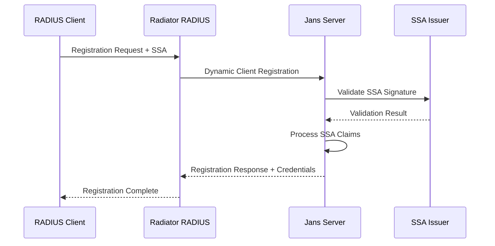

# Radiator Integration Modernization Wiki

## Table of Contents
1. [Background & Problem Statement](#1-background--problem-statement)
2. [Requirements Specification](#2-requirements-specification)  
3. [Target Architecture](#3-target-architecture)
4. [Agama Flow Design](#4-agama-flow-design)
5. [Authorization & Cedarling Integration](#5-authorization--cedarling-integration)
6. [Client Registration (SSA)](#6-client-registration-ssa)
7. [Migration Plan](#7-migration-plan)
8. [Open Questions](#8-open-questions)

---

## 1. Background & Problem Statement

### Current State: ROPG-Based Integration

The existing integration between Gluu Server/Jans and Radiator RADIUS server uses OAuth 2.0 Resource Owner Password Grant (ROPG) flow:

```
[RADIUS Client] --RADIUS--> [Radiator RADIUS] --ROPG--> [Jans /token] --Response--> [Radiator] --RADIUS--> [RADIUS Client]
```

### Critical Problems

**Security Vulnerabilities:**
- Password exposure in authentication flows
- Limited MFA support with ROPG
- No contextual policy enforcement
- Credential theft risks

**Operational Limitations:**
- Manual OAuth client registration
- Static authentication logic
- Poor scalability for enterprise networks
- Limited audit capabilities

**Technical Debt:**
- ROPG deprecated in OAuth 2.1
- Tight coupling between layers
- Configuration complexity
- Limited extensibility

---

## 2. Requirements Specification

### Functional Requirements

#### FR-1: Authentication Flow Modernization
- Replace ROPG with /authorization_challenge endpoint
- Execute Agama flows for authentication logic
- Support multi-step authentication including MFA
- Maintain RADIUS protocol compliance
- Provide backward compatibility during migration

#### FR-2: Policy-Based Authorization  
- Integrate Cedarling for Cedar policy evaluation
- Provide complete authentication context to policy engine
- Support dynamic policy updates without restart
- Include policy-determined attributes in RADIUS responses
- Default to deny for policy evaluation failures

#### FR-3: SSA-Based Client Registration
- Accept Software Statement Assertions for registration
- Validate SSA signatures and claims
- Provision OAuth credentials and RADIUS secrets automatically
- Support credential lifecycle management
- Provide comprehensive audit trails

### Non-Functional Requirements

#### Security Requirements
- No plaintext password transmission
- AES-256-GCM encryption for credentials at rest
- TLS 1.3 with mutual authentication
- Rate limiting and brute force protection
- Input validation and sanitization

#### Performance Requirements
- 95% of requests processed within 200ms
- Minimum 1000 requests/second per instance
- Horizontal scaling support
- Connection pooling and caching
- Performance monitoring endpoints

---

## 3. Target Architecture

### High-Level Architecture

```mermaid
graph TB
    subgraph "Network Access Layer"
        RC[RADIUS Client/NAS]
    end
    
    subgraph "RADIUS Processing Layer"
        RR[Radiator RADIUS Server]
    end
    
    subgraph "Authentication & Authorization Layer"
        subgraph "Jans Server"
            ACE[/authorization_challenge Endpoint]
            AF[Agama Flow Engine]
            DCR[Dynamic Client Registration]
        end
        
        subgraph "Policy Layer"
            CL[Cedarling Policy Engine]
            CP[Cedar Policies]
        end
    end
    
    subgraph "Identity Layer"
        IDS[Identity Data Store]
    end
    
    RC -->|RADIUS Access-Request| RR
    RR -->|Authorization Challenge| ACE
    ACE -->|Execute Flow| AF
    AF -->|Policy Evaluation| CL
    CL -->|Policy Decision| AF
    AF -->|User Lookup| IDS
    AF -->|Challenge Response| ACE
    ACE -->|Auth Result| RR
    RR -->|RADIUS Access-Accept/Reject| RC
```

### Component Responsibilities

#### Radiator RADIUS Server
- Terminate RADIUS protocol from NAS devices
- Translate RADIUS requests to authorization challenges
- Map responses back to RADIUS Access-Accept/Reject
- Handle SSA-based client registration
- Maintain RADIUS shared secrets and accounting

#### Jans Server /authorization_challenge Endpoint
- Accept authentication challenges from Radiator
- Route requests to appropriate Agama flows
- Coordinate with Cedarling for policy evaluation
- Return structured authentication/authorization responses
- Support dynamic client registration via SSA

#### Agama Flow Engine
- Execute customizable authentication business logic
- Support multi-step authentication processes
- Integrate with external authentication providers
- Provide authentication context to authorization layer
- Handle errors and edge cases gracefully

#### Cedarling Policy Engine
- Evaluate Cedar policies for authorization decisions
- Process authentication context and RADIUS attributes
- Return policy decisions with additional attributes
- Support dynamic policy updates
- Provide audit trails for policy evaluations

---

## 4. Agama Flow Design

### Primary RADIUS Authentication Flow

**Flow Name:** `radius-auth-flow`

#### Step-by-Step Logic

**Step 1: Input Validation and Context Setup**
```pseudocode
FLOW radius-auth-flow(inputs)
  BEGIN
    // Validate required inputs
    IF user_identifier IS EMPTY OR radius_attributes IS EMPTY THEN
      RETURN error("INVALID_REQUEST", "Missing required parameters")
    END IF
    
    // Initialize flow context
    flow_context = {
      request_id: inputs.request_id,
      start_time: current_timestamp(),
      user_identifier: inputs.user_identifier,
      client_id: inputs.client_metadata.client_id,
      nas_ip: inputs.radius_attributes["NAS-IP-Address"]
    }
    
    LOG_AUTH_ATTEMPT(flow_context)
```

**Step 2: User Identity Resolution**
```pseudocode
    user_identity = CALL resolve_user_identity(inputs.user_identifier)
    
    IF user_identity IS NULL THEN
      LOG_AUTH_FAILURE(flow_context, "USER_NOT_FOUND")
      RETURN error("AUTHENTICATION_FAILED", "Invalid user identifier")
    END IF
    
    // Enrich context with user attributes
    flow_context.user_attributes = user_identity.attributes
    flow_context.user_groups = user_identity.groups
```

**Step 3: Authentication Method Execution**
```pseudocode
    auth_policy = CALL get_authentication_policy(user_identity, client_config)
    required_methods = auth_policy.required_authentication_methods
    
    FOR EACH method IN required_methods DO
      SWITCH method
        CASE "password":
          result = CALL authenticate_password(user_identity, inputs.authentication_context.password)
        CASE "mfa_totp":
          result = CALL authenticate_totp(user_identity, inputs.authentication_context.mfa_token)
        CASE "certificate":
          result = CALL authenticate_certificate(user_identity, inputs.authentication_context.certificate)
      END SWITCH
      
      IF NOT result.success THEN
        LOG_AUTH_FAILURE(flow_context, "AUTH_METHOD_FAILED", method)
        RETURN error("AUTHENTICATION_FAILED", result.error_message)
      END IF
    END FOR
```

**Step 4: Risk Assessment**
```pseudocode
    risk_factors = {
      nas_ip: inputs.radius_attributes["NAS-IP-Address"],
      time_of_day: current_time(),
      user_location: user_identity.last_known_location
    }
    
    risk_score = CALL calculate_risk_score(risk_factors)
    flow_context.risk_score = risk_score
    
    // Apply conditional authentication based on risk
    IF risk_score > auth_policy.high_risk_threshold THEN
      // Require additional MFA
      additional_mfa = CALL authenticate_totp(user_identity, inputs.authentication_context.mfa_token)
      IF NOT additional_mfa.success THEN
        RETURN error("AUTHENTICATION_FAILED", "Additional authentication required")
      END IF
    END IF
```

**Step 5: Authorization Policy Evaluation**
```pseudocode
    policy_context = {
      principal: {
        type: "User",
        id: user_identity.id,
        attributes: {
          groups: user_identity.groups,
          department: user_identity.department,
          authentication_methods: flow_context.authentication_methods
        }
      },
      action: {
        type: "NetworkAccess",
        id: "radius_authentication"
      },
      resource: {
        type: "NetworkResource",
        attributes: {
          nas_ip: inputs.radius_attributes["NAS-IP-Address"],
          service_type: inputs.radius_attributes["Service-Type"]
        }
      },
      context: {
        time: current_timestamp(),
        risk_score: flow_context.risk_score
      }
    }
    
    policy_decision = CALL cedarling_evaluate_policy(policy_context)
```

**Step 6: Response Generation**
```pseudocode
    SWITCH policy_decision.decision
      CASE "Allow":
        response_attributes = MERGE(
          policy_decision.additional_attributes,
          client_config.default_attributes
        )
        
        LOG_AUTH_SUCCESS(flow_context, policy_decision)
        
        RETURN success_response({
          user_identity: user_identity,
          authentication_methods: flow_context.authentication_methods,
          authorization_attributes: response_attributes
        })
        
      CASE "Deny":
        LOG_AUTH_FAILURE(flow_context, "POLICY_DENIED")
        RETURN error("AUTHORIZATION_FAILED", policy_decision.reason)
        
      CASE "Challenge":
        LOG_AUTH_CHALLENGE(flow_context, policy_decision.challenge_requirements)
        RETURN challenge_response({
          challenge_type: policy_decision.challenge_requirements.type,
          challenge_data: policy_decision.challenge_requirements.data
        })
    END SWITCH
    
  END FLOW
```

---

## 5. Authorization & Cedarling Integration

### Cedar Policy Examples

**Base Network Access Policy:**
```cedar
permit(
  principal is User,
  action == Action::"NetworkAccess",
  resource is NetworkResource
) when {
  principal.groups.contains("network_users") &&
  principal.authentication_methods.contains("password") &&
  resource.nas_ip in ["192.168.1.0/24", "10.0.0.0/8"]
};
```

**MFA Requirements Policy:**
```cedar
permit(
  principal is User,
  action == Action::"NetworkAccess",
  resource is NetworkResource
) when {
  context.risk_score > 0.7 &&
  principal.authentication_methods.contains("mfa_totp")
};
```

**Department-Based Access:**
```cedar
permit(
  principal is User,
  action == Action::"NetworkAccess",
  resource is NetworkResource
) when {
  principal.department == "engineering" &&
  resource.network_segment == "development" &&
  context.time >= time("06:00:00") &&
  context.time <= time("22:00:00")
};
```

### Policy Evaluation Context

**Input Structure:**
```json
{
  "principal": {
    "type": "User",
    "id": "user123",
    "attributes": {
      "groups": ["network_users", "engineering"],
      "department": "engineering",
      "authentication_methods": ["password", "mfa_totp"]
    }
  },
  "action": {
    "type": "NetworkAccess",
    "id": "radius_authentication"
  },
  "resource": {
    "type": "NetworkResource",
    "attributes": {
      "nas_ip": "192.168.1.100",
      "service_type": "Framed-User",
      "network_segment": "corporate"
    }
  },
  "context": {
    "time": "2024-01-09T10:30:00Z",
    "risk_score": 0.2,
    "authentication_strength": "multi_factor"
  }
}
```

**Decision Output:**
```json
{
  "decision": "Allow",
  "policies_evaluated": ["base-network-access", "mfa-requirements"],
  "additional_attributes": {
    "Session-Timeout": 3600,
    "Framed-IP-Address": "10.0.1.100",
    "Filter-Id": "engineering_acl"
  },
  "audit_info": {
    "evaluation_time": "2024-01-09T10:30:01Z",
    "policy_version": "v1.2.3"
  }
}
```

---

## 6. Client Registration (SSA)

### SSA Benefits for RADIUS Integration

**Traditional Challenges:**
- Manual OAuth client registration doesn't scale
- Difficult to establish cryptographic trust
- Complex credential distribution
- Limited audit capabilities

**SSA Solutions:**
- Cryptographic trust via signed JWTs
- Automated self-service registration
- Scalable for hundreds/thousands of clients
- Centralized policy control
- Complete audit trail

### SSA Structure

**JWT Header:**
```json
{
  "alg": "RS256",
  "typ": "JWT",
  "kid": "ssa-issuer-key-2024-01"
}
```

**SSA Payload:**
```json
{
  "iss": "https://network-authority.example.com/ssa-issuer",
  "sub": "radius-client-nas-building-a-001",
  "aud": "https://jans.example.com",
  "iat": 1704801600,
  "exp": 1736337600,
  "jti": "ssa-12345678-abcd-efgh-ijkl-123456789012",
  
  "software_statement": {
    "client_name": "Corporate NAS Device - Building A",
    "client_description": "Cisco ISR 4331 - Main Office Network Access Server",
    "software_id": "cisco-isr-4331",
    
    "client_metadata": {
      "nas_identifier": "nas-building-a-001",
      "nas_ip_address": "192.168.1.100",
      "location": "Building A, Floor 1, Network Closet",
      "administrator_contact": "netadmin@example.com"
    },
    
    "oauth_metadata": {
      "grant_types": ["client_credentials"],
      "scope": "radius_auth radius_accounting",
      "token_endpoint_auth_method": "client_secret_basic"
    },
    
    "radius_metadata": {
      "accounting_enabled": true,
      "session_timeout_default": 3600
    }
  }
}
```

### Registration Flow



**Registration Response:**
```json
{
  "client_id": "radius_client_nas_building_a_001_1704801600",
  "client_secret": "8f7e6d5c4b3a2918f7e6d5c4b3a29187",
  "client_secret_expires_at": 1736337600,
  
  "radius_configuration": {
    "shared_secret": "r4d1u5_5h4r3d_53cr3t_n45_bu1ld1ng_4_001",
    "nas_identifier": "nas-building-a-001",
    "accounting_enabled": true,
    "session_timeout_default": 3600
  },
  
  "oauth_configuration": {
    "token_endpoint": "https://jans.example.com/oauth/token",
    "authorization_challenge_endpoint": "https://jans.example.com/oauth/authorization_challenge",
    "scope": "radius_auth radius_accounting"
  }
}
```

---

## 7. Migration Plan

### Phased Migration Strategy

#### Phase 1: Infrastructure Preparation (Weeks 1-4)
- Deploy new Jans server components
- Implement dual-mode support in Radiator
- Establish SSA issuance infrastructure
- Create migration tooling and monitoring

#### Phase 2: Pilot Migration (Weeks 5-8)
- Migrate 5-10% of RADIUS clients
- Validate end-to-end functionality
- Identify and resolve integration issues
- Establish operational procedures

#### Phase 3: Gradual Production Rollout (Weeks 9-16)
```
Week 9:  10% - Low-risk production clients
Week 10: 20% - Standard production clients
Week 11: 25% - High-volume clients
Week 12: 25% - Critical infrastructure
Week 13: 15% - Remaining clients
Week 14: 5%  - Legacy/special configurations
```

#### Phase 4: Legacy Cleanup (Weeks 17-20)
- Decommission ROPG endpoints
- Remove dual-mode support
- Archive migration tooling
- Conduct post-migration security review

### Dual-Mode Configuration

**Radiator Configuration:**
```ini
<Handler Request-Type=Access-Request>
    <AuthBy GROUP>
        # New authorization_challenge flow
        <AuthBy RADIUS>
            Identifier NewAuthFlow
            Host jans.example.com
            Endpoint /oauth/authorization_challenge
            ClientFilter %{Client:MigrationStatus} eq 'MIGRATED'
        </AuthBy>
        
        # Legacy ROPG flow
        <AuthBy RADIUS>
            Identifier LegacyAuthFlow
            Host jans.example.com
            Endpoint /oauth/token
            GrantType password
            ClientFilter %{Client:MigrationStatus} ne 'MIGRATED'
        </AuthBy>
    </AuthBy>
</Handler>
```

### Risk Mitigation

**High-Risk Scenarios:**
1. **Authentication Service Outage** - Maintain legacy endpoints, automatic failover
2. **Policy Engine Failure** - Fail-secure defaults, HA deployment
3. **SSA Compromise** - Revocation procedures, short-lived SSAs
4. **Performance Degradation** - Load testing, connection pooling

**Rollback Triggers:**
- Authentication success rate < 99%
- Response time > 500ms for >5% requests
- Security incident or credential compromise
- Critical system component failure

---

## 8. Open Questions

### Technical Architecture

#### Question 1: Agama Flow Performance Optimization
**Issue**: How to optimize flow execution for high-volume authentication?
**Options**: Pre-compile flows, result caching, connection pooling
**Owner**: Jans Engineering Team
**Timeline**: Before Phase 2

#### Question 2: Cedarling Policy Caching
**Issue**: What caching strategy for policy evaluation results?
**Options**: Decision caching, policy caching, distributed cache, no caching
**Owner**: Security Architecture Team
**Timeline**: Before Phase 1

#### Question 3: SSA Key Rotation Frequency
**Issue**: How frequently should SSA signing keys rotate?
**Options**: Monthly, quarterly, annual, event-driven
**Owner**: Security Operations Team
**Timeline**: Before Phase 1

### Operational Procedures

#### Question 4: Migration Rollback Automation
**Issue**: Automation level for rollback procedures?
**Options**: Fully automated, semi-automated, manual with tooling
**Owner**: SRE Team
**Timeline**: Before Phase 2

#### Question 5: Monitoring Thresholds
**Issue**: Appropriate alerting thresholds?
**Metrics**: Success rate, response time, error rate thresholds
**Owner**: Operations Team
**Timeline**: Before Phase 1

### Security and Compliance

#### Question 6: SSA Distribution Security
**Issue**: How to securely distribute SSAs to clients?
**Options**: Encrypted email, automation, self-service portal, API
**Owner**: Security Engineering Team
**Timeline**: Before Phase 1

#### Question 7: Audit Log Retention
**Issue**: Requirements for log retention and analysis?
**Considerations**: Compliance, volume, analysis needs, retention period
**Owner**: Compliance and Security Teams
**Timeline**: Before Phase 2

---

## Conclusion

This modernization represents a significant improvement in security, scalability, and operational efficiency. The phased approach minimizes risk while delivering enhanced capabilities through:

- **Enhanced Security**: Elimination of password exposure, policy-based authorization
- **Operational Efficiency**: Automated client registration via SSA
- **Scalability**: Horizontal scaling support for enterprise networks
- **Flexibility**: Customizable flows and dynamic policy updates
- **Compliance**: Comprehensive audit logging and security controls

Success depends on careful planning, thorough testing, and collaboration between security, engineering, and operations teams.
